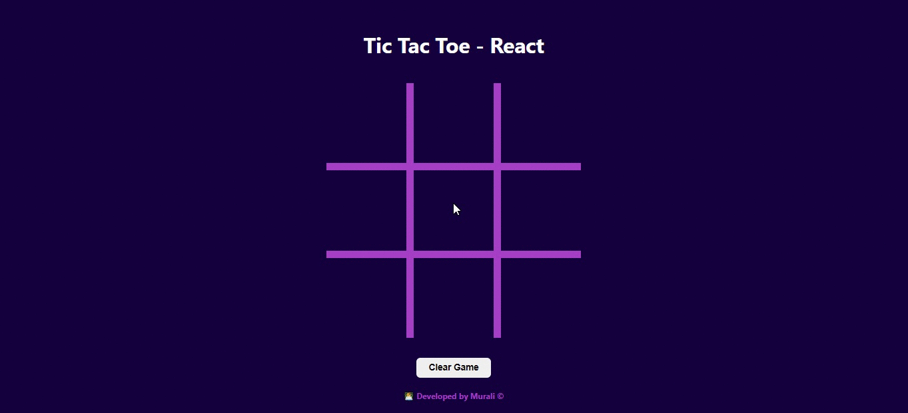

### `npm start`

Runs the app in the development mode.\
Open [http://localhost:3000](http://localhost:3000) to view it in your browser.

The page will reload when you make changes.\
You may also see any lint errors in the console.

## Tic Tac Toe using React Hooks- ReactJS projects

### Application Demo -
https://tic-tac-toe-02.netlify.app/

### Development steps-
1. Create React App using npx create-react-app
2. Designing the UI i.e. Game board using JSX and CSS.
3. Used React Hooks to manage the state of the application.
4. For the winning state- it shows an alert with Winner's name.

